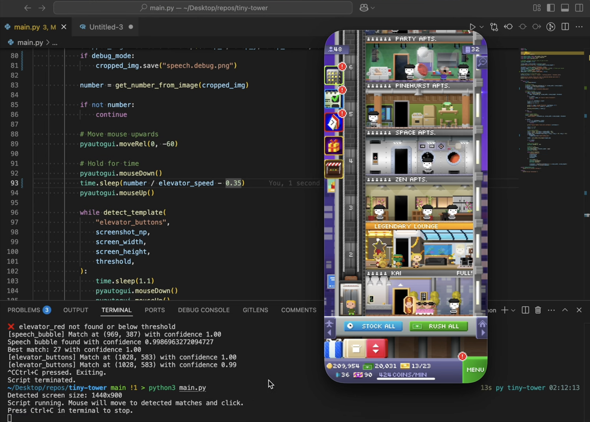

# 🏙️ Tiny Tower Elevator Automation
A Python-based automation built to help service Bitizens who request elevator rides and automatically delivers them to the correct floor — fully hands-free.

Used to farm coins in the mobile game [Tiny Tower by NimbleBit](https://en.wikipedia.org/wiki/Tiny_Tower), running on an iPhone emulator.

Involves real-time computer vision, OCR, and GUI automation working together to interpret and act on live game state from the screen.

See the demo video here: https://youtu.be/gLSVFT6-tY0



## 🚀 Getting Started
Have Tiny Tower running in any emulator and visible on the screen. Then run the following.

```bash
python3 -m venv venv
source venv/bin/activate
pip3 install -r requirements.txt
python3 main.py
```

## 🛠️ Technologies & Tools Used

| Tool            | Purpose                                           |
|-----------------|---------------------------------------------------|
| **Python**      | Core scripting language                           |
| **PyAutoGUI**   | Mouse control & screen interaction                |
| **Pillow (PIL)**| Image processing and cropping                     |
| **NumPy**       | Efficient image matrix manipulation               |
| **OpenCV**      | Template matching for UI detection (in `detect_template`) |
| **Tesseract OCR** (via `get_number_from_image`) | Reads target floor numbers from speech bubbles |
